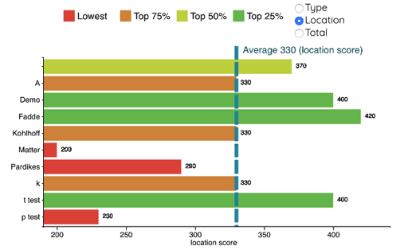
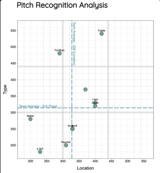
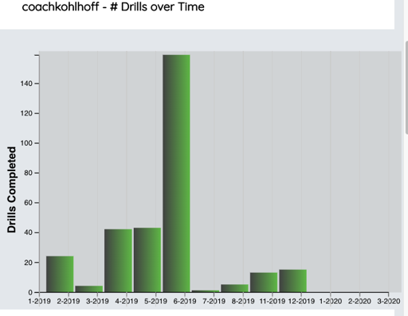
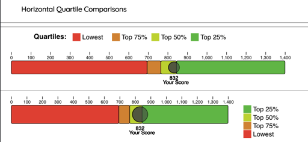
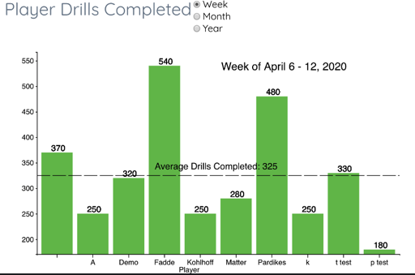

# GameSense Chart Components Documentation
---
## *TeamCompareChart.js*
*Horizontal barchart that displays the Type, Location or Total scores of each player on a team.*



---
#### Props / Example Usage
* svg_width (pixels)
* svg_height (pixels)
``` javascript
<TeamCompareChart svg_width={700} svg_height={400}/>
```
NOTE: You will need to use the RadioButtons Component in a ChartHeader as follows:
```javascript
    render() {
        const ChartHeader = props =>
                (<div style={{'display': 'flex', 'flexDirection': 'row', 'alignItems': 'center'}}>
                    {/* <h3>Team Test Scores</h3> */}
                    <PassThruContainer>
                        <LegendHoriz svg_width={490} textLabel={' '} />
                    </PassThruContainer>
                    <RadioButtons
                        handleSelect={props.handleSelect}
                        options={ [{name:'Type',value:'type'},{name:'Location',value:'location'},{name:'Total',value:'total'}] }
                        initSelectedOption={'total'} />
                </div>);

        return (<Fragment>
          <div>                
            <TeamTestsPrScoreContainer socket={this.props.socket}>
                <LocVsTypeChart svg_height={500} svg_width={500} svg_border_opacity={0.5}/>
                <ChartHeader/>
              <TeamCompareChart svg_width={700} svg_height={400}/>
            </TeamTestsPrScoreContainer>
          </div>
        </Fragment>)   
    }
```
---

## *LocVsTypeChart.js*
*Scatter chart that displays each team member's Location and Type score with a 9-box overlay to compare relative performance.*



#### Props / Example Usage
* svg_width (pixels)
* svg_height (pixels)
* svg_border_opacity (0-1)  - set to 0 for no svg perimeter border
``` javascript
            <TeamTestsPrScoreContainer socket={this.props.socket}>
                <LocVsTypeChart svg_height={500} svg_width={500} svg_border_opacity={0.5}/>
            </TeamTestsPrScoreContainer>    
```
---

## *BarChart.js*
*Bar chart that displays how many drills a user has completed per time period.*



#### Props / Example Usage
* none 
``` javascript
 <PlayerUseOverTime socket={createSocket(username, app, token)} dispatch={dispatch} filters={(userId?{user_id:userId}:null)}>
        <BarChart>
            <TimeSeriesPickList dispatch={dispatch}/>
        </BarChart>
    </PlayerUseOverTime>);
```
---

## *HorizontalQuartileChart.js*
*Horizontal bar that displays that displays which quartile a player's score falls within all the team member's scores.*



#### Props / Example Usage
* svg_width (pixels)
* svg_height (pixels) 
Note: use either a Vertical or Horizontal legend with this chart

##### With Horizontal Legend:
``` javascript
<ComparisonChartContainer socket={this.props.socket}>
    <LegendHoriz  />
    <HorizontalQuartileChart svg_width={680} svg_height= {80}/>
 </ComparisonChartContainer>    
```
##### With Vertical Legend:
``` javascript
     // note: for vertical legend, 'svg_height' values between chart and legend must match!
     //       LegendVertical yPos moves the legend elements up and down in its own little svg 
<ComparisonChartContainer socket={this.props.socket}>
    <HorizontalQuartileChart svg_width={550} svg_height= {100}/> 
    <LegendVertical  yPos={25}               svg_height= {100}/>  
 </ComparisonChartContainer>
```
---

## *PlayerDrills.js*
#### *Incomplete: not ready - still need data container to provide data, date label*
*Vertical bar chart showing tem player names on X-axis and the number of drills they completed in a given time on the Y-axis.*


#### Props / Example Usage
* svg_width (pixels)
* svg_height (pixels)
``` javascript
<NewPlayerUseOverTimeContainer>
    <PlayerDrills svg_width={700} svg_height={400}/>
<NewPlayerUseOverTimeContainer/>  
```
---
- **Mark Kauffman**

